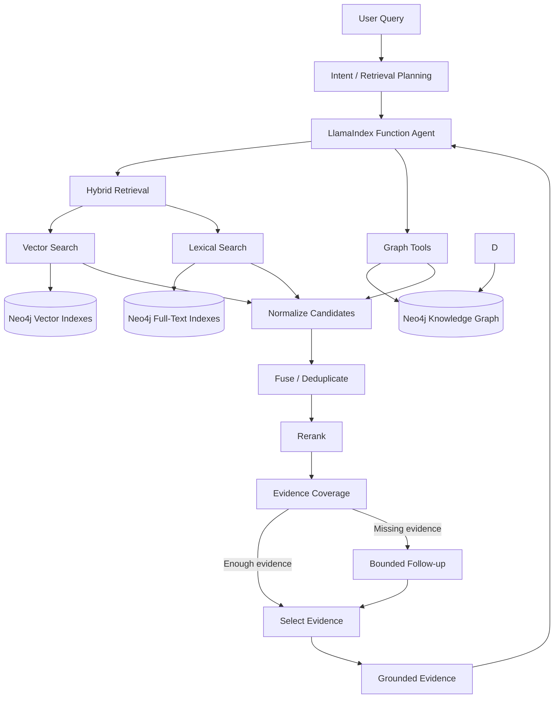

# Nexus Graph — Agentic GraphRAG for JIRA Incident Intelligence

> An agent-driven GraphRAG system for investigating JIRA incidents using hybrid semantic + lexical retrieval, Neo4j graph traversal, dynamic Cypher generation, and LlamaIndex function tools.

## Overview

**Nexus Graph** combines a Neo4j knowledge graph with semantic search, lexical search, and agentic tool use to investigate enterprise JIRA incidents. The repository is explicitly described as a GraphRAG project for JIRA incidents and separates Neo4j operations, retrieval engines, schemas/prompts, agent orchestration, and tool implementations. 

Core capabilities include:
- Neo4j knowledge graph for incident entities and relationships
- Vector search for semantic similarity
- Neo4j full-text search for exact terms and identifiers
- LlamaIndex `FunctionAgent` and `FunctionTool`
- Hybrid retrieval with Query Fusion / Reciprocal Rank Fusion
- Relationship discovery and multi-hop graph traversal
- Exact node inspection
- Dynamic, read-only Cypher retrieval
- Async Neo4j/database operations

## The Problem

Incident investigation is rarely a single-document search problem. A question may require:

```text
Incident description
        ↓
Find similar historical incidents
        ↓
Identify affected systems / environments / tracks
        ↓
Find investigations, comments and repository objects
        ↓
Traverse connected incidents
        ↓
Inspect exact evidence
        ↓
Produce a grounded answer
```

A vector-only RAG system can miss exact identifiers and relationship structure. A graph-only system can struggle with fuzzy natural-language descriptions. Nexus Graph combines both.

## Architecture



The retrieval engine follows the implemented sequence: query + intent → retrieval plan → concurrent lexical/vector/graph retrieval → normalization → fusion → reranking → evidence coverage → bounded follow-up when needed → evidence selection. 

## Why GraphRAG?

### Semantic retrieval
Useful for broad or conversational incident descriptions where wording varies.

### Lexical retrieval
Useful for exact JIRA keys, error codes, environment names, system names, and other identifiers. The implementation queries Neo4j full-text indexes directly.

### Graph retrieval
Useful when the answer depends on relationships such as:

```text
Ticket
 ├── impacts → System
 ├── belongs to → Track
 ├── has_label → Label
 ├── has_investigation → Investigation
 ├── has_repository_objects → Repository Object
 └── has_comment → Comment
```

The repository includes dedicated relationship-discovery, multi-hop traversal, and exact-node-detail tools.

## Hybrid Retrieval

The project implements LlamaIndex-compatible vector and full-text retrievers and combines them with `QueryFusionRetriever` using Reciprocal Rank Fusion.

Conceptually:

```text
Query
 ├── Ticket vector search
 ├── Investigation vector search
 ├── Repository vector search
 ├── Ticket full-text search
 ├── System full-text search
 └── Investigation full-text search
                  ↓
        Reciprocal Rank Fusion
                  ↓
          Candidate Set
                  ↓
             Reranking
```

The repository defines multiple vector indexes for tickets, investigation reports, repository objects, comments, and a broader semantic search path. These vector indexes use 3072-dimensional embeddings with cosine similarity.

## Agentic Retrieval

The LlamaIndex agent is equipped with specialized function tools for:
- hybrid retrieval
- ticket relationship discovery
- ticket network traversal
- exact node details
- connected-node content
- dynamic Cypher execution

The agent is therefore not constrained to a single fixed retrieval chain: it can use specialized tools according to the retrieval requirement.

## Dynamic Cypher

One of the project's strongest capabilities is the ability to escalate from predefined retrieval tools to a general graph-query mechanism.

Example requirement:

> Find incidents affecting system X that are connected to a repository change and have an investigation mentioning a similar failure.

A fixed vector search cannot reliably express the whole requirement. Dynamic Cypher can.

```text
User requirement
      ↓
Agent determines missing evidence
      ↓
Builds read-only Cypher
      ↓
Execute against Neo4j
      ↓
Return structured evidence
```

The implementation defines a structured Cypher model containing the query and parameter representation, with the intent that the generated query is read-only.

## Evidence-Aware Retrieval

The system does not treat retrieval as simply “return top-k”.

After candidate retrieval, results are normalized, fused, reranked, and checked for evidence coverage. If important evidence is still missing, the retrieval engine supports a bounded follow-up round rather than uncontrolled recursive searching.

This is a key reliability property:

```text
Retrieve
   ↓
Did we satisfy the evidence requirement?
   ├── Yes → Select evidence
   └── No  → Bounded follow-up retrieval
```

## Async / Concurrent Retrieval

Neo4j access uses the asynchronous Python driver and the retrieval stack exposes async execution. The retrieval engine is designed to run lexical, vector, and graph retrieval concurrently where appropriate.

The vector path also moves embedding generation behind an async thread boundary, while the hybrid retriever is configured for asynchronous execution.

## Neo4j Data Model

The graph represents JIRA incidents and surrounding engineering context. Representative entities include:

```text
Ticket
Person
Environment
System
Label
Track
Investigation Report
Repository Object
Comment
```

Representative relationship types include:

```text
IS_OF_TYPE
BELONGS_TO_TRACK
HAS_LABEL
IMPACTS
AFFECTS_SYSTEM
HAS_REPOSITORY_OBJECTS
HAS_INVESTIGATION
HAS_COMMENT
```

## Retrieval Tools

### `hybrid_retrieval_tool`
Combines selected vector and lexical retrievers using LlamaIndex Query Fusion and Reciprocal Rank Fusion.

### `get_ticket_relations_tool`
Discovers direct graph relationships from a known ticket.

### `traverse_ticket_network_tool`
Performs multi-hop traversal for connected incidents and dependency chains.

### `get_node_details_tool`
Retrieves complete properties/content for an exact Neo4j node identified from graph discovery.

### Dynamic Cypher
Provides a flexible read-only graph query path when a predefined retrieval tool cannot express the evidence requirement efficiently.

## Project Structure

```text
nexus-graph/
├── api/
├── data/
├── embedding/
├── exported-jira-data/
├── json-exports/
├── preprocessed-exports/
├── release-sheet/
│
├── llama_index_module/
│   ├── graphrag_retrieval_engine/
│   ├── graphrag_retrieval_engine_v1/
│   ├── retrieval/
│   │   ├── config.py
│   │   ├── coverage.py
│   │   ├── engine.py
│   │   ├── fusion.py
│   │   ├── graph.py
│   │   ├── lexical.py
│   │   ├── models.py
│   │   ├── tools.py
│   │   └── vector.py
│   ├── schema_and_prompts/
│   ├── toolsets/
│   │   └── function_tools.py
│   ├── chat.py
│   ├── reasoning_agent.py
│   └── retrieval_agent.py
│
├── neo4j_module/
│   ├── connection.py
│   ├── constraints.py
│   ├── full_text_indexes.py
│   ├── importer.py
│   ├── main.py
│   ├── mapper.py
│   ├── queries.py
│   └── vector_indexes.py
│
├── jira_scrape.py
├── preprocess.py
├── preprocess_trans.py
├── to_json.py
├── streamlit.py
└── LICENSE
```

## Technology Stack

| Technology | Purpose |
|---|---|
| Python | Application/orchestration |
| LlamaIndex | Agent and retrieval orchestration |
| Neo4j | Knowledge graph and indexed retrieval |
| Cypher | Graph querying |
| OpenAI Embeddings | Dense semantic representations |
| OpenAI LLM | Agent reasoning/tool use |
| Async Python | Concurrent retrieval and I/O |
| Streamlit | Interactive UI |

The current code configures `text-embedding-3-large` at 3072 dimensions and an OpenAI Responses-based LLM inside the LlamaIndex function-agent layer.

## Getting Started

### Clone

```bash
git clone https://github.com/saadahmed388/nexus-graph.git
cd nexus-graph
```

### Environment

```bash
python -m venv .venv
```

Windows:

```bash
.venv\Scripts\activate
```

Install the repository's Python dependencies and configure the required Neo4j and LLM credentials in a `.env` file.

Example:

```env
OPENAI_API_KEY=your_key

NEO4J_LOCAL_URI=bolt://localhost:7687
NEO4J_LOCAL_USER=neo4j
NEO4J_LOCAL_PASS=your_password
```

### Run

The repository includes a Streamlit application:

```bash
streamlit run streamlit.py
```

## Security Considerations

Dynamic Cypher should be treated as a privileged retrieval capability.

Recommended production controls:
- use a read-only Neo4j account
- validate generated Cypher
- restrict labels/relationships available to the agent
- enforce timeouts and result limits
- parameterize user-derived values
- log generated queries and tool decisions
- never grant write privileges to the retrieval agent

## Engineering Highlights

- Multi-modal retrieval rather than vector-only RAG
- Graph-aware incident investigation
- LLM-driven retrieval planning
- Specialized LlamaIndex function tools
- Dynamic schema-aware Cypher retrieval
- Evidence coverage checks
- Reciprocal Rank Fusion across retrieval modalities
- Multi-hop graph traversal
- Async Neo4j execution
- Modular retrieval architecture

## Future Production Hardening

Potential next steps include:
- retrieval evaluation with Recall@K / MRR / NDCG
- latency and tool-call telemetry
- distributed tracing
- Cypher sandboxing/validation
- permission-aware graph access
- stronger automated regression tests
- prompt/tool versioning
- retrieval-quality and grounded-answer evaluation

## License

Licensed under the Apache License 2.0. See [LICENSE](LICENSE).

## Author

**Saad Ahmed**

GitHub: https://github.com/saadahmed388
